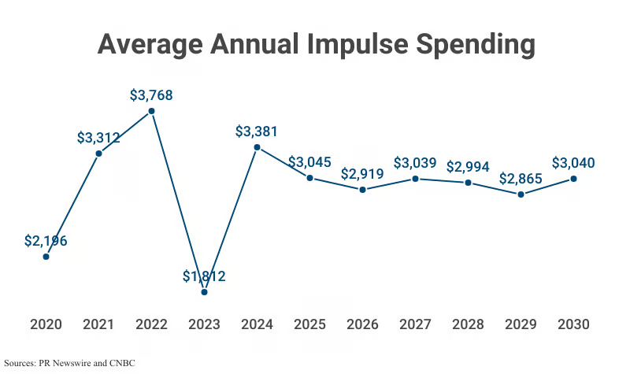
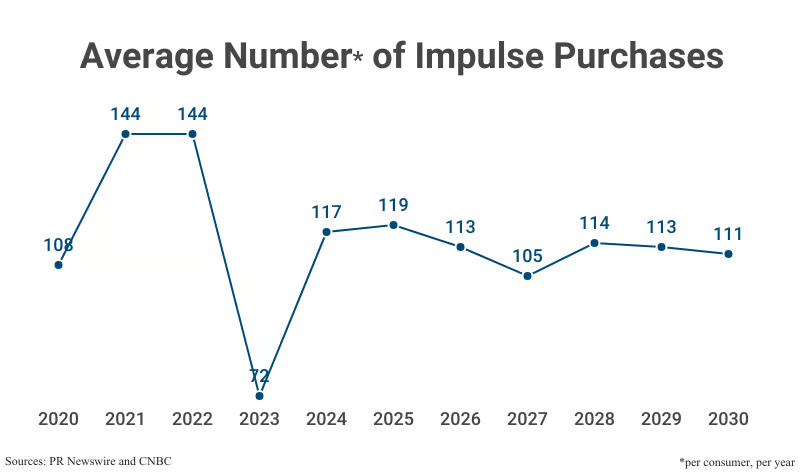
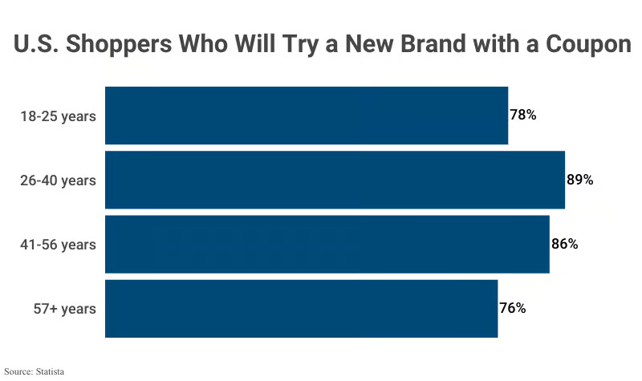

# Table of Contents
1. [Ten Domains](#ten-domains)
2. [Problems and Selections](#problems-and-selections)
	- [Online shopping](#online-shopping)
		- [Impulse purchases and inconvenient expense tracking](#impulse-purchases-and-inconvenient-expense-tracking-✅)
		- [Difficulty in finding the best deal across platforms or over time](#difficulty-in-finding-the-best-deal-across-platforms-or-over-time)
		- [Complexity in tracking package delivery across platforms](#complexity-in-tracking-package-delivery-across-platforms)
	- [Health (workout and diet)](#health-workout-and-diet)
		- [Food sensitivities and body reactions](#food-sensitivities-and-body-reactions-✅)
		- [Uncertainty about which workout routine matches health goals](#uncertainty-about-which-workout-routine-matches-health-goals)
		- [Recovery after workouts, irregular schedules, and stress](#recovery-after-workouts-irregular-schedules-and-stress)
	- [Productivity, scheduling, and planning](#productivity-scheduling-and-planning)
		- [Over-ambitious scheduling that does not match reality](#over-ambitious-scheduling-that-does-not-match-reality-✅)
		- [Time-consuming planning and tracking](#time-consuming-planning-and-tracking)
		- [Too many disconnected apps](#too-many-disconnected-apps)
3. [Stakeholders](#stakeholders)
	- [Impulse purchases and inconvenient expense tracking](#impulse-purchases-and-inconvenient-expense-tracking)
	- [Food sensitivities and body reactions](#food-sensitivities-and-body-reactions)
	- [Over-ambitious scheduling that does not match reality](#over-ambitious-scheduling-that-does-not-match-reality)
4. [Evidence and Comparable](#evidence-and-comparable)
	- [Impulse purchases and inconvenient expense tracking](#impulse-purchases-and-inconvenient-expense-tracking)
		- [Evidence](#evidence)
		- [Comparables](#comparables)
	- [Food sensitivities and body reactions](#food-sensitivities-and-body-reactions)
		- [Evidence](#evidence)
		- [Comparables](#comparables)
	- [Over-ambitious scheduling that does not match reality](#over-ambitious-scheduling-that-does-not-match-reality)
		- [Evidence](#evidence)
		- [Comparables](#comparables)
5. [Features](#features)
	- [Impulse purchases and inconvenient expense tracking](#impulse-purchases-and-inconvenient-expense-tracking)
	- [Food sensitivities and body reactions](#food-sensitivities-and-body-reactions)
	- [Over-ambitious scheduling that does not match reality](#over-ambitious-scheduling-that-does-not-match-reality)

# Ten Domains
The following shows ten domains (general problem areas) that I am interested in, including seven unselected and three selected domains.

## Seven unselected domains
1. **Tennis:** Practicing tennis with my coach and friends regularly, competing in local amateur matches, and enjoying exploring new tennis accessories like racquets or shoes.

2. **Limited sneakers and collectable toys:** Following new sneaker and toy releases, collecting limited editions with high price potential, and tracking value change over time.

3. **Pet care and wellness:** Feeding, walking, and monitoring daily digestion, sleep, mood, and health of my pets.

4. **Dining and food exploration:** Trying new restaurants, cuisines, and food trends in the cities I live in.

5. **Coffee, energy drinks, boba:** Drinking them daily to keep myself energized or bring myself a happy mood. However, worrying about over-consumption of caffeine or sugar.

6. **Video games and e-sports:** Playing MOBA games with friends at leisure. Watching competitive e-sports games to support my favorite teams and to learn strategies. Also hoping to avoid addiction during busy school days.

7. **Travel and city exploration:** Discovering unique and cool local spots (which is called “citywalk-ing”) and visiting different countries to explore diverse landscapes and cultures. 

## Three selected domains

8. **Online shopping:** I have been an active online shopper for years, with an Amazon Prime membership and regular use of platforms like Best Buy for electronics, eBay for secondhand, rare items, StockX for sneakers, Amazon for everyday goods, and brand websites. While I enjoy browsing for cool products and comparing deals, the shopping experience can be fragmented — finding products I need, switching between multiple platforms to find the best price, keeping track of things I already bought, viewing delivery status, and verifying product authenticity. This domain interests me because it allows me to boost the experience of something that a lot of people and I do almost daily.

9. **Health (workout and diet):**  After getting sick quite frequently last year, I began paying closer attention to my overall health and physical strength. I now go to the gym at least three times a week and follow a stricter diet, avoiding foods that trigger food sensitivity reactions. To stay consistent, I use multiple apps to track calories burned, workouts completed, and meals consumed each day. Yet, I still face persistent uncertainties: Why does my body react differently from day to day? Should I adjust my food intake depending on how I feel? Which foods truly support my health? And does my workout routine actually align with my long-term goals?

10. **Productivity, scheduling, and planning:** I have the habit of planning out my routine ahead of time and tracking progress daily to (hopefully) enhance productivity. I spend a lot of time experimenting with productivity tools like Notion, calendar apps, and Trello. Although many of these apps are powerful, I often find them overly complex and not tailored to my personal routine. Since I use several apps concurrently, I often spend over an hour each day updating schedules and tracking progress, making me feel inefficient about my daily workflow. During several conversations with friends who also use these productivity tools, we often wonder: Is there a simpler and more elegant solution for productivity management?

# Problems and Selections
I identified three problem for each of the three selected domains above and highlighted the three problems worth pursuing (marked as ✅).

## Online shopping
### Impulse purchases and inconvenient expense tracking (✅)
When shopping online, I often make impulse purchases like small accessories, flashy on-sale items, or “suggested for you” products that I did not even plan for. While I eventually realized that these purchases are not necessary, there is no quick way to reflect on or log them at the moment of purchase. I wasn’t able to rationally distinguish whether I “need” or “want” something. Also, most expense-tracking apps require complicated manual input, so I often forget or avoid recording my spending. Consequently, my monthly spending feels less transparent, and I lose track of how much I’m actually spending, making me unaware of the impulse purchases I have made.

I selected this problem because impulse shopping is something many shoppers experience regularly. Online platforms are designed to encourage quick purchases through flash sales and recommendations, which makes it difficult to pause and reflect on whether I actually need the item. I believe this problem has authentic demand because financial awareness and budgeting are important to people who shop frequently online. The problem also doesn’t seem to require solutions that are overambitious or require critical mass.

### Difficulty in finding the best deal across platforms or over time
When shopping online — whether for electronics, sneakers, or everyday items — I often worry I’m overpaying or missing a better deal elsewhere. Checking multiple sites or tracking price changes manually is time-consuming, and I sometimes regret buying too soon when the same product appears cheaper later. This uncertainty makes online shopping stressful.

Although this frustration is common, established tools like Honey and CamelCamelCamel already (partly) address it. Creating a solution that meaningfully improves on these products would be challenging and risks lacking differentiation.

### Complexity in tracking package delivery across multiple platforms
Shopping on sites like Amazon, eBay, StockX, and brand stores leaves me juggling multiple package tracking numbers across emails and apps. Checking delivery status often means digging through messages, logging into accounts, or switching between delivery apps, which is time-consuming and prone to missed updates. I often wish there were a single, unified view of all my deliveries.

The challenge is user indifference: while this problem is a real pain point, many people may not pay for a solution when they can manage by spending extra time (such as tracking delivery status in emails). Building such a product is also technically difficult, since not all e-commerce platforms offer APIs, and scraping delivery data could raise privacy concerns.

## Health (workout and diet)

### Food sensitivities and body reactions (✅)
Even though I log calories and meals, my body often feels different from day to day — sometimes energized, sometimes sluggish, sometimes with digestive discomfort. However, I don't know what are the main causes of these symptoms. Many of my friends report similar issues, including constipation, bloating, or drowsiness caused by the food they eat. These issues are frustrating as they affect productivity and mood, but are also too minor to bring to a doctor. While food sensitivity tests exist, they aren’t widely trusted in the medical field and are often expensive. This leaves me and others with little guidance on what foods may actually be affecting my body. I wish there were a way to better connect what I eat to how I feel so that I could make smarter food choices.

I select this problem because food sensitivities represent a genuine issue with authentic demand. The problem does not require complex scientific breakthroughs to address; instead, a practical solution can be built around logging and visualizing the connection between diet and health outcomes. When I discussed food sensitivity with friends, many said they were affected by this problem. One friend noted, “We shouldn’t feel embarrassed about dealing with constipation or diarrhea. Those things happen to everyone. But we should really understand what food is the cause of the issues.” A solution to this problem could help many people who are troubled by these everyday health “glitches” better understand their own bodies and food sensitivities. Compared with other health-related problems (mentioned below), a solution to this problem carries fewer risks of “unexpected consequences” since it is grounded in users’ own logging of diet and symptom patterns.

### Uncertainty about which workout routine matches health goals
At the gym, I try to balance strength training, cardio, and stretching, but I’m often unsure whether my routine truly aligns with my health goals or body type. Most fitness apps track activity and calories but rarely adapt to individual needs. I frequently wonder: am I overtraining, undertraining, or simply doing the wrong kind of exercise? Clearer, personalized feedback on my workout routine would make a big difference.

However, building a solution to this problem would require deeper research in sports medicine and health science, in addition to coding the software. It also carries potential risks, such as recommending inappropriate exercises that could harm users.

### Recovery after workouts, irregular schedules, and stress
I often struggle with recovery, as soreness, fatigue, and stress don’t always improve with rest. Irregular eating and sleep habits make things worse, and I’m unsure whether to prioritize nutrition, sleep, or stress management for the best recovery effectiveness. While many apps track workouts or sleep individually, few connect these factors to show how they interact and impact recovery. Without better guidance, it’s difficult to optimize my health.

However, this problem involves too many variables — nutrition, sleep, stress, etc. — making it hard to isolate solutions through a simple software app. It also carries risks, since incorrect guidance could hinder rather than support recovery.

## Productivity, scheduling, and planning

### Over-ambitious scheduling that does not match reality (✅)
When I plan my daily routines, I often create highly detailed schedules packed with ambitious goals. However, in practice, unexpected events, procrastination, or shifting priorities disrupt my schedule. By the end of the day, my calendar could look completely different from what actually happened. This mismatch leaves me feeling guilty or unproductive the next morning, even though I usually did complete meaningful work—just not the exact tasks I had originally scheduled. I wish scheduling tools were more flexible and forgiving, offering support that adapts to what actually happens and helping me learn how to optimize future plans.

I chose this problem because it reflects one of the most frustrating parts of my daily routine. I believe there is an authentic demand, since most existing productivity tools cannot quickly and easily adjust to real-time changes in schedules. These tools leave users stuck with rigid plans that do not reflect the realities of their lives. Most apps emphasize “sticking to the plan” instead of helping users adapt to changes gracefully. The framing of this problem requires no critical mass and is not overambitious. By addressing it, I could create something genuinely useful for many people, including myself.

### Time-consuming planning and tracking
I spend a significant amount of time updating information stored in productivity tools to manage my schedule, tasks, progress, and expenses. Most productivity apps require entering so much information that by the time I finish logging, it feels like I’ve spent as much energy organizing my day as I have doing the actual work. While I value being organized, the work it takes to constantly update information is tiring and inefficient. A faster, less repetitive way to log and track routines would make planning feel like support rather than extra work.

The solution to this problem would require ambitious technological innovation, as it involves redefining the way productivity apps function. It would demand creating a new software that operates more efficiently and intuitively than established tools like Notion. Therefore, I didn’t select this problem.

### Too many disconnected apps
My productivity setup is split across multiple platforms—Notion for notes, Trello for projects, Google Calendar for scheduling, and more. Each tool works well in its own domain, but they don’t integrate smoothly. I end up duplicating information, forgetting updates, or feeling overwhelmed and losing track of tasks. Switching between so many apps just to stay organized feels inefficient. A unified system that integrates core features would be beneficial.

However, this problem may not have a wide demand, since many people already commit to only one single platform like Notion or Google Workspace. Building a solution would also be technically challenging, requiring numerous API integrations—and some platforms may not even provide public APIs, creating significant obstacles.

# Stakeholders

## Impulse purchases and inconvenient expense tracking
1. Shopper (direct user): They are people like me who make impulse purchases online. They are impacted because they feel regret or stress about overspending, and a lack of transparent access to spending records makes the problem even worse for them, because they are unaware of the amount they have spent on impulse purchases.

2. Families (non-users): People who share the Shopper’s finances or living expenses. They may also be affected when Shopper's overspending leads to tighter budgets or financial conflicts. For instance, parents cut the living expenses they give to their children if their children overspend frequently.

3. Retail platforms (non-users): Online platforms like Amazon and eBay. They benefit from impulse purchases. Any solution that encourages reflection before buying could negatively impact their sales.

## Food sensitivities and body reactions
1. Food-sensitive individuals (direct users): These are people who regularly experience issues such as constipation, bloating, or fatigue triggered by the foods they eat. They struggle to identify which foods are linked to their symptoms. As a result, they are directly affected by ongoing confusion, discomfort, and uncertainty about their diet.

2. Healthcare professionals (“indirect users”): Doctors and dietitians whom food-sensitive individuals may consult when their symptoms persist. They are impacted by the problem because a well-designed solution could support these professionals by providing structured logs and context, making it easier to understand the patient’s dietary patterns and potential triggers.

3. Friends and family (non-users): People who share meals, live together, or socialize with the food-sensitive individuals. They are indirectly impacted when the food-sensitive individuals struggle with food sensitivities. For example, they would need to avoid certain restaurants, change shared meal plans, or be affected by the food-sensitive individual’s low energy or discomfort during activities.

## Over-ambitious scheduling that does not match reality
1. Productivist (direct users): Mostly students and professionals who hope to boost daily productivity through planning and scheduling. They are the primary users, often overloading schedules and feeling frustrated when plans fail.

2. Peers, teammates, or coworkers (users or non-users): People who are involved in the Productivist’s plans or schedules. When the Productivists’ planning causes missed deadlines or rescheduling, others in their circle are also impacted, causing them to also reschedule to accommodate new changes.

3. Productivity tool developers (non-users): ​​These are companies that create productivity and scheduling apps such as Notion or Google Calendar. Recognizing and addressing this problem could give them valuable insights into designing more adaptive, user-centered tools. However, a highly effective solution may also draw users away from their existing platforms, potentially reducing engagement with their current products.

# Evidence and Comparable

## Impulse purchases and inconvenient expense tracking
### Evidence
1. [Scale of impulse purchases](https://capitaloneshopping.com/research/impulse-buying-statistics/): Nearly nine out of ten shoppers (89%) have made impulse purchases, with more than half (54%) having spent at least $100 on a single unplanned purchase. In 2024, consumers spent an average of $281.75 each month on impulse purchases. Shoppers make roughly 9.75 impulse purchases per month, averaging $28.90 per item. Although there was a market correction in impulse spending in 2023, the amount of spending is rebounded in 2024 and is expected to remain decently high in the years ahead .

2. [Price and discounts play major roles in driving impulse purchases.](https://capitaloneshopping.com/research/discount-statistics/) About 91% of Americans look for discounts before buying online, and 67% have made an unplanned purchase when presented with a discount. A product that offers a 20% discount is twice as likely to be purchased compared to its regular price. Coupons and sales significantly influence shoppers across all age groups, from 18 to over 57 years old.

3. 40 % of all e-commerce spending stems from impulse purchases, emphasizing the [large share impulse behavior holds in online retail.](https://www.invespcro.com/blog/impulse-buying/?utm_source=chatgpt.com)

4. The driving forces behind impulse purchase are complex. [Experts defined four types of impulse purchases](https://www.cnbc.com/select/how-to-avoid-impulse-buying/):
    - Pure impulse buying: Purchases driven by sudden emotions or urges, without prior intention
    - Reminder impulse buying: Purchases triggered when something reminds the shopper of a related need.
    - Suggestion impulse buying: Purchases influenced by marketing messages or recommendations.
    - Planned impulse buying: Purchases anticipated in advance, but motivated by discounts or promotions.

5. [Psychologists explain that emotional triggers drive impulse purchases.](https://time.com/6200717/online-shopping-psychology-explained/) For example, Jorge Barraza, program director and assistant professor in the online master of science in applied psychology program at the University of Southern California, said, “When we’re sad, when we’re stressed, we’re more likely to engage in this kind of behavior.” Nevertheless, in many cases, this spark of excitement from buying interesting items do not persist, especially when shoppers realized they have overspent their money.

6. [Expert suggests that apps with the following features can reduce impulse purchases:](https://aicompetence.org/stop-impulse-buying-with-smart-ai-apps/)
Customized spending alert
Clear insights into users’ financial health
Real-time updates

### Comparables
7. The [Stop Impulse Buying](https://www.stopimpulse.com/) app offers a no-spending tracker and savings challenges designed to reduce impulse purchases. However, it functions largely as a static platform that delivers educational and motivational content. Its biggest limitation is the heavy reliance on manual user engagement — something many impulsive shoppers may find difficult to sustain.

8. The [SpendWise](https://apps.apple.com/us/app/spendwise-mindful-spending/id6496203443) app tracks shopping carts and spending while motivating users to avoid impulse purchases by highlighting the money they’ve saved. However, it does not actively assist users in deciding whether an item is a “need” or a “want,” which are crucial in addressing impulse purchases. Shoppers must still spend time reflecting on these decisions themselves, limiting the app’s effectiveness at the moment of purchase.

9. The [Mint](https://mint.intuit.com/) app consolidates users’ assets across multiple accounts and provides an overview of their monthly spending. While reviewing these records can increase awareness of overall spending habits, they fall short in guiding shoppers to make rational choices (i.e., the "need" vs. "want" decision mentioned above) at the critical moment of purchase.

10. Many people prefer tracking expenses using [ready-made templates](https://www.notion.com/templates/category/personal-finance) in everyday tools like Google Sheets or Notion. The limitation is that it costs time and effort to organize and update these templates every time a purchase is made.

## Food sensitivities and body reactions
### Evidence
1. [A large-scale review](https://pubmed.ncbi.nlm.nih.gov/34254938/) found that nutrition app adoption is hindered by hundreds of distinct barriers, ranging from usability issues to trust and privacy concerns. This shows that even though many people want tools to track diet and health, technology often falls short in accessibility and reliability. The conclusion of the research suggests designing nutrition apps to target specific user groups to increase engagement.

2. Gluten and carbohydrate sensitivities are [underdiagnosed](https://en.wikipedia.org/wiki/Non-celiac_gluten_sensitivity). Non-celiac gluten sensitivity (NCGS) affects 0.5–13% of the population, and 30% of the population in the United States and Australia were eating gluten-free food regularly in 2014. There exist many unanswered questions around gluten sensitivity, such as whether the symptoms are permanent or transient, depending on the body's condition.

3. [There is a high prevalence of intolerance symptoms.](https://www.uptodate.com/contents/food-intolerance-and-food-allergy-in-adults-an-overview#H374023795) About 15% to 20% of the population reports food intolerances (e.g., bloating, constipation, fatigue). These symptoms are common enough to affect daily life but often dismissed as “minor” issues not warranting medical care. Also, food intolerance generally involves issues with the digestive system.

4. [At-home food sensitivity tests lack scientific credibility](https://www.nm.org/healthbeat/healthy-tips/are-at-home-food-sensitivity-tests-effective), and clinical experts dismiss many at-home sensitivity kits as misleading, often expensive, and medically unjustified, leaving users frustrated and without clear answers.

    > "These food sensitivity tests are not scientific at all," explains Dr. Watts, who has expertise in allergy and immunology. "They can also be expensive, and they can cause you to take things out of your diet that don't need to be eliminated."

5. [Non-coeliac gluten/wheat sensitivity (NCG/WS) remains a critical issue that remains uncertain.](https://pmc.ncbi.nlm.nih.gov/articles/PMC6682924/#sec5-nutrients-11-01684) Many people are self-diagnosed as “gluten sensitive” because they experience digestive symptoms (stomach pain, bloating, irregular bowel movements) or non-digestive symptoms (brain fog, headaches, fatigue, skin issues, numbness). Nevertheless, when scientists run rigorous tests, only a small percentage (5%-14%) of self-identified NCG/WS patients are confirmed to be sensitive to gluten by the test result.  The food sensitivity result deviates from how patients actually feel.

6. [Gastrointestinal (GI) symptoms can exist without a definitive diagnosis from a healthcare provider.](https://link.springer.com/article/10.1007/s10620-024-08521-7) As a result, individuals frequently eliminate foods like dairy, gluten, or caffeine on their own. An internet survey found that respondents most commonly linked certain foods to their abdominal pain. Studies show there is both widespread public interest and a clinical need to understand how chronic GI symptoms are connected to food consumption.

7. [Research shows that Quality-of-life (QoL) is affected by intolerance.](https://pubmed.ncbi.nlm.nih.gov/27188918/) In lactose intolerance, both objective malabsorption and self-perceived intolerance are linked to poorer health-related QoL, indicating that day-to-day well-being is affected, not just digestion.

8. [Work productivity gets hindered by diet-induced GI disorders.](https://pmc.ncbi.nlm.nih.gov/articles/PMC5310011/) Adults with IBS-D (Irritable Bowel Syndrome with Diarrhea) experience around $2486 in indirect costs annually from productivity loss. The symptoms also negatively impact the IBS sufferers for an average of 9 days per month. These data show a clear adverse impact when food sensitivity is not well managed.

### Comparables
9. [MyFitnessPal](https://www.myfitnesspal.com/) is designed to help users track and manage their daily diet by logging foods consumed and breaking them down into nutrient proportions (protein, fat, and carbohydrates). While effective for diet management, the app is primarily aimed at weight control and nutrition tracking. It does not (directly) address food sensitivity issues or provide insights into how specific foods may correlate with symptoms such as bloating, fatigue, or digestive discomfort.

10. [Bowelle](https://apps.apple.com/us/app/bowelle-the-ibs-tracker/id1436064640) is an app that allows users to log feelings, food intake, water consumption, stress levels, and bowel movements, presenting the data in simple chart visualizations. However, its functionality is limited: the app does not analyze or suggest correlations between logged factors and bowel health, and the range of data types it tracks is fairly narrow. The interface feels outdated, and bowel movement tracking is restricted to frequency only—without details such as stool type or consistency.

## Over-ambitious scheduling that does not match reality

### Evidence
1. Many discussions on Reddit are complaining that overly relying on too many productivity tools can hinder work efficiency, and that simple tools with more flexibility could work better. People demanded “[something that doesn’t make me spend more time managing the app than actually doing the tasks](https://www.reddit.com/r/ProductivityApps/comments/1fpcdav/ive_tried_so_many_productivity_apps_over_the_years/),” “[spending more time 'doing' rather than 'planning'](https://www.reddit.com/r/productivity/comments/1bpx3uq/using_too_many_appstools_is_killing_my/),” and “[reclaiming control over my workflow without the unnecessary noise](https://www.reddit.com/r/productivity/comments/1anvcvu/productivity_apps_can_be_toxic/)."

2. [Market overview](https://www.businessresearchinsights.com/market-reports/productivity-apps-market-117791): The global productivity apps market is valued at $12.26 billion in 2025 and is expected to grow to $13.39 billion in 2026. Looking ahead, it is projected to reach USD 29.56 billion by 2035, reflecting a steady compound annual growth rate of 9.2% between 2026 and 2035, showing a strong growth and high potential of this market.

3. [Planning fallacy](https://en.wikipedia.org/wiki/Planning_fallacy) is pervasive. Many people systematically underestimate task time compared to reality, which is core to why plans are often too optimistic and scheduled routines go off-script.

4. [Meetings hijack prime focus time](https://www.microsoft.com/en-us/worklab/work-trend-index/breaking-down-infinite-workday): Meetings stretch the day and fragment plans. Microsoft’s 2025 Work Trend Index shows nearly 30% of meetings now span multiple time zones (increased by 35% since 2021), and late-night meetings are up 16% year over year, increasing schedule volatility and off-hours work. The interruptions and fragmentation of daily routines caused by meetings deteriorate workers’ productivity.

5. [Ad-hoc and last-minute changes are common.](https://www.axios.com/2025/06/17/microsoft-remote-work-meetings) 57% of meetings are ad hoc with no calendar schedule or invite, and 10% are added at the last minute, directly undermining rigid daily schedules.
    > "For many, the workday now feels like navigating chaos — reacting to others' priorities and losing focus on what matters most.” 

6. [Context-switching is costly as it induces stress, distracts attention, and has a high cost of time.](https://www.atlassian.com/blog/loom/cost-of-context-switching) Research shows that around 40% productivity is lost from context switching and $450 billion annual loss in productivity globally. An unreasonable schedule may have frequent context-switching, leading to inefficiencies in completing the scheduled tasks.

7. [Procrastination or 'intentional delay'?](https://www.apa.org/gradpsych/2010/01/procrastination) Research finds that 80% to 95% of college students procrastinate, and similar tendencies exist in broader knowledge work. Procrastination is common and natural, and it prevents precise adherence to plans. Acknowledging procrastination and considering it as part of the plan is important.

### Comparables
8. [Reclaim.ai](https://reclaim.ai/) is a software that automatically performs time blocking to achieve better focus and more productive deep work. While the platform provides powerful features, it remains calendar- and schedule-driven. Users must invest effort upfront in configuration, scheduling, and priority tuning, which can make the setup process complex. Moreover, the app lacks adaptive feedback mechanisms to learn from discrepancies between planned tasks and what actually gets accomplished, limiting its ability to optimize future routines.

9. [Apple, Notion, Google Calendar](https://www.notion.com/product/calendar): These are common choices for scheduling daily routines. These apps focus on scheduling and do not offer routine optimization or address the planning fallacy.

10. [RescueTime](https://www.rescuetime.com/) is a tool that monitors focus sessions and daily activities, offering valuable logging of how time is actually spent and enabling users to reflect on their workflow. While it helps raise awareness of tasks achieved during a day and can improve focus quality over time, it does not function as an adaptive scheduler. Users must still rely on additional platforms to re-adjust and optimize their plans, which introduces extra complexity.

# Features
Here are the features I designed for each of the three problems.

## Impulse purchases and inconvenient expense tracking
1. Impulse flagging: Import the shopping cart from multiple e-commerce platforms, including Amazon, eBay, Walmart, etc. Use purchase patterns — such as flash sales, “Recommended for you” suggestions, or late-night browsing — and large language models (LLMs) to automatically flag transactions as “likely impulse.” The app then visualizes proportions of impulse purchases made by the Shopper. This feature alerts the Shopper when there is a possible impulsive purchase, helping them recognize and resist unnecessary buys.

2. “Need vs. Want” reflection: Before checkout, an AI agent iteratively prompts the Shopper to reflect on each item in their cart: Is this a “need” or just a “want?” The agent also provides reasons why it thinks a purchase might be impulsive. If the Shopper marks the item as a “want,” it is then automatically removed and stored in a “Money Saved from Impulse Spending” page. A dashboard tracks and displays the total money saved by avoiding impulse buys. Shoppers can also create a Wish List, where the app shows progress toward affording desired items (as an incentive to the Shopper) using money saved from resisted impulse purchases. This feature helps Shoppers reduce impulse purchases, helping them build the habit of pausing and reflecting before spending.

3. Seamless spending tracker: For items purchased, expenses are automatically recorded in a personal dashboard. Shoppers can also log spending quickly through a conversational interface — by typing or speaking (e.g., “Bought a textbook for $10”). The AI agent interprets the input and updates the dashboard, ensuring quick, low-friction expense tracking without much manual work. The dashboard provides a visualization of monthly/yearly expenses. This feature addresses the lack of easy access to spending records, making financial tracking effortless and transparent for Shoppers. By giving Shoppers a better view of their spending habits, they are motivated to reduce unnecessary spending to save money.

## Food sensitivities and body reactions
1. Meal logging: Users (food-sensitive individuals) can record meals either by manual entry or by uploading a photo of their food. An integrated large language model (LLM) automatically extracts and identifies food and drink items from the image, then categorizes them for the user. This feature provides a quick, user-friendly way to capture dietary information without tedious manual input, laying the foundation for meaningful food–symptom correlation analysis later on.

2. Digestion & Symptom Logging + Food—Symptom Correlation: For digestion tracking, users (food-sensitive individuals) can log stool type, shape, consistency, and frequency. A built-in timer allows them to track the start and end of bowel movements for more precise data. To ensure a positive user experience, stool categories are represented with “cute” cartoon-style illustrations, keeping the interface approachable and less uncomfortable. Beyond digestion, users can log other common symptoms such as bloating, fatigue, or drowsiness. The app then cross-references symptom entries with food logs. For each symptom, the app displays a rank of food types that appear most frequently on days when that symptom occurs and also flags each food type as “most likely,” “possible,” or “unlikely” to trigger that symptom. This helps users uncover potential links between their diet and how their body feels.

3. At the end of each day, the app provides a clear snapshot of the user’s overall health. This includes foods consumed, logged symptoms, energy and mood levels, and any flagged patterns of concern. Over time, these summaries allow users to build an empirical understanding of their food sensitivities, empowering them to make smarter dietary choices based on observed trends rather than guesswork.

## Over-ambitious scheduling that does not match reality
1. Adaptive daily routine tracker: Users (Productivists) can create tasks in the app and press “Start” to begin tracking. When the task is finished, they click “Finish,” and the system automatically records the actual time and task on the calendar. If the task was previously scheduled but took longer than expected, the app intelligently reorders the rest of the day — reshuffling priorities while still respecting deadlines and user-defined importance levels. This feature ensures that high-value work is surfaced and Productivists are not penalized for deviations, turning the schedule into a flexible and adaptive reflection of reality rather than a rigid plan.

2. Planned vs. Actual Timeline/Calendar View: At the end of the day, Productivists can compare their planned schedule with the actual routine they experience during the day. The interface highlights discrepancies between intended and actual routines, offering insights without judgment. By reframing missed plans as learning opportunities, this feature helps Productivists reflect productively, reduce guilt, and identify patterns in how their time is really spent.

3. When setting up new future schedules, the app leverages past data to provide evidence-based recommendations. It identifies time blocks or task types where Productivists are prone to procrastination and flags instances where estimated durations may be unrealistic. This feature helps Productivists create more achievable schedules, preventing overload, boosting motivation, and ultimately improving efficiency by aligning plans with real-life behaviors.

