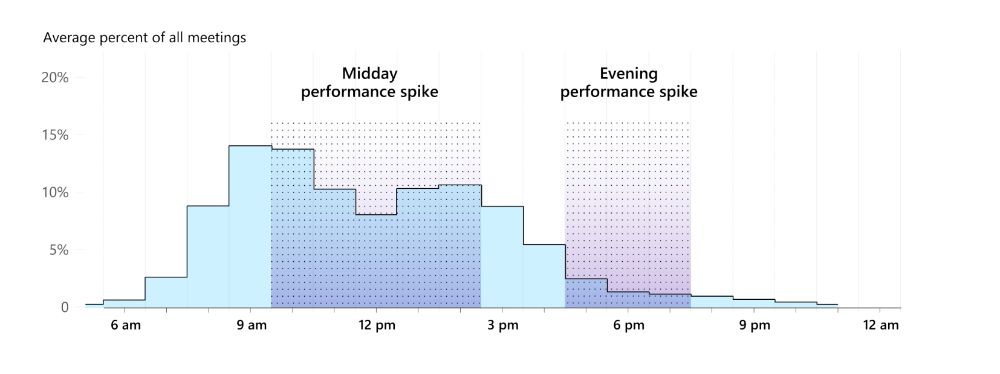

# Part One: Problem statement
## Problem domain: Productivity, scheduling, and planning
I have the habit of planning out my routine ahead of time and tracking progress daily to enhance productivity. I spend a lot of time experimenting with productivity tools like Notion, calendar apps, and Trello, trying to keep my life scheduled and organized. Although many of these apps are powerful, I often find them overly complex and not tailored to my personal routine. I often spend over an hour each day updating schedules and tracking progress, making me feel inefficient about my daily workflow.

## Problem: Over-ambitious scheduling that does not match reality
When I plan my daily routines, I often create highly detailed schedules packed with ambitious goals. However, in practice, unexpected events, procrastination, or shifting priorities disrupt my schedule. By the end of the day, my calendar could look completely different from what actually happened. This mismatch leaves me feeling guilty or unproductive the next morning, even though I usually did complete meaningful work; just not the exact tasks I had originally scheduled. Most existing productivity tools cannot quickly and easily adjust to real-time changes in schedules. These tools leave users stuck with rigid plans that do not reflect the realities of their lives. Most apps emphasize “sticking to the plan” instead of helping users adapt to changes gracefully. I wish scheduling tools were more flexible and forgiving, offering support that adapts to what actually happens and helping me learn how to optimize future plans.

## Stakeholders
1. Productivist (direct users): Mostly students and professionals who hope to boost daily productivity through planning and scheduling. They are the primary users, often overloading schedules and feeling frustrated when plans fail.

2. Peers, teammates, or coworkers (direct users or non-users): People who are involved in the Productivist’s plans or schedules. They are impacted by the problem because when the Productivists’ planning causes missed deadlines or rescheduling, others in their circle are also impacted, causing them to also reschedule to accommodate new changes.

3. Productivity tool developers (non-users): ​​These are companies that create productivity and scheduling apps such as Notion or Google Calendar. They are impacted by this problem because recognizing and addressing this problem could give them valuable insights into designing more adaptive, user-centered tools. However, a highly effective solution (that are not implemented by themselves) may also draw users away from their existing platforms, potentially reducing engagement with their current products.

## Evidence
1. **Many demand for a better productivity solution:** Many discussions on Reddit are complaining that overly relying on too many productivity tools can hinder work efficiency, and that simple tools with more flexibility could work better. People demanded “[something that doesn’t make me spend more time managing the app than actually doing the tasks](https://www.reddit.com/r/ProductivityApps/comments/1fpcdav/ive_tried_so_many_productivity_apps_over_the_years/),” “[spending more time 'doing' rather than 'planning'](https://www.reddit.com/r/productivity/comments/1bpx3uq/using_too_many_appstools_is_killing_my/),” and “[reclaiming control over my workflow without the unnecessary noise](https://www.reddit.com/r/productivity/comments/1anvcvu/productivity_apps_can_be_toxic/)."

2. [**Planning fallacy is pervasive:**](https://en.wikipedia.org/wiki/Planning_fallacy) Many people systematically underestimate task time compared to reality, which is core to why plans are often too optimistic and scheduled routines go off-script.

3. [**Meetings hijack prime focus time:**](https://www.microsoft.com/en-us/worklab/work-trend-index/breaking-down-infinite-workday) Meetings stretch the day and fragment plans. Microsoft’s 2025 Work Trend Index shows nearly 30% of meetings now span multiple time zones (increased by 35% since 2021), and late-night meetings are up 16% year over year, increasing schedule volatility and off-hours work. The interruptions and fragmentation of daily routines caused by meetings deteriorate workers’ productivity, making them unable to finish their schedules.

4. [**Ad-hoc and last-minute changes are common and disastrous:**](https://www.axios.com/2025/06/17/microsoft-remote-work-meetings) 57% of meetings are ad hoc with no calendar schedule or invite, and 10% are added at the last minute, directly undermining rigid daily schedules.
    > "For many, the workday now feels like navigating chaos — reacting to others' priorities and losing focus on what matters most.” 

5. [**Context-switching is costly:**](https://www.atlassian.com/blog/loom/cost-of-context-switching) It induces stress, distracts attention, and has a high cost of time. Research shows that around 40% productivity is lost from context switching and $450 billion annual loss in productivity globally. An unreasonable schedule may have frequent context-switching, leading to inefficiencies in completing the scheduled tasks.

6. [**Reclaim.ai Solution:**](https://reclaim.ai/) This is a software that automatically performs time blocking to achieve better focus and more productive deep work. While the platform provides powerful features, it remains calendar- and schedule-driven. Users must invest effort upfront in configuration, scheduling, and priority tuning, which can make the setup process complex. Moreover, the app lacks adaptive feedback mechanisms to learn from discrepancies between planned tasks and what actually gets accomplished, limiting its ability to optimize future routines.

7. [**RescueTime Solution:**](https://www.rescuetime.com/) This is a tool that monitors focus sessions and daily activities, offering valuable logging of how time is actually spent and enabling users to reflect on their workflow. While it helps raise awareness of tasks achieved during a day and can improve focus quality over time, it does not function as an adaptive scheduler. Users must still rely on additional platforms to re-adjust and optimize their plans, which introduces extra complexity.

# Application Pitch: Introducing NEO $\to$ the ONE calendar app you need
## Motivation
Most productivity tools force people into rigid plans that crumble the moment real life interferes, while students and professionals need not just another static planner, but a dynamic companion that learns, adjusts, and help them grow.

## Key features
Neo tackles the scheduling and productivity problems by making daily planning flexible and adaptive:
1. **Adaptive routine tracker**: Productivists simply press Start and Finish on tasks. Neo logs actual time spent on the calendar and automatically reorganizes the day when tasks run long or go expected, so priorities and deadlines still get met without punishing Productivists for delays. This features helps Productivists focus on what matters most and reduces stress when the routine shifts.

2. **Schedule plans**: Productivists create tasks for future days by specifying key fields like task type, priority, deadlines, estimated duration, and flexibility (i.e., split and move booleans). Neo then translate this into a responsive plan that adjusts smoothly as real life unfolds, respecting constraints while mitigating frustrations caused by last-minute changes. 

3. **Smart scheduling suggestions**: drawing from previous schedules and logs on actual activities, Neo identifies time blocks or task types where Productivists are prone to procrastination and flags instances where estimated durations may be unrealistic. Neo then provides evidence-based suggestions for realistic task durations, better focus windows, and time blocks for relax or debrief, empowering users to design plans that work more efficiently in practice.
