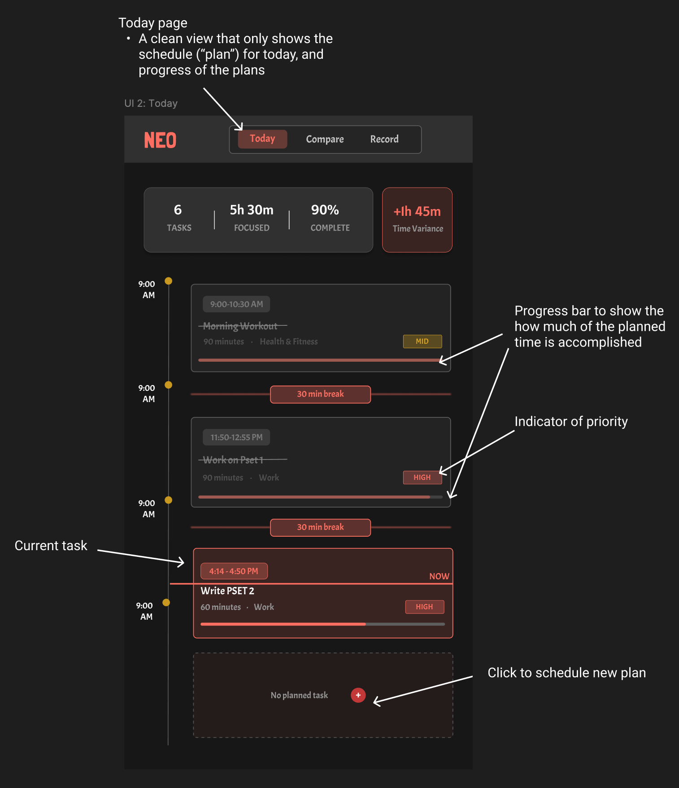

# Problem statement
## Problem domain: Productivity, scheduling, and planning
I have the habit of planning out my routine ahead of time and tracking progress daily to enhance productivity. I spend a lot of time experimenting with productivity tools like Notion, calendar apps, and Trello, trying to keep my life scheduled and organized. Although many of these apps are powerful, I often find them overly complex and not tailored to my personal routine. I often spend over an hour each day updating schedules and tracking progress, making me feel inefficient about my daily workflow.

## Problem: Over-ambitious scheduling that does not match reality
When I plan my daily routines, I often create highly detailed schedules packed with ambitious goals. However, in practice, unexpected events, procrastination, or shifting priorities disrupt my schedule. By the end of the day, my calendar could look completely different from what actually happened. This mismatch leaves me feeling guilty or unproductive the next morning, even though I usually did complete meaningful work; just not the exact tasks I had originally scheduled. Most existing productivity tools cannot quickly and easily adjust to real-time changes in schedules. These tools leave users stuck with rigid plans that do not reflect the realities of their lives. Most apps emphasize “sticking to the plan” instead of helping users adapt to changes gracefully. I wish scheduling tools were more flexible and forgiving, offering support that adapts to what actually happens and helping me learn how to optimize future plans.


## Stakeholders
1. Productivist (direct users): Mostly students and professionals who hope to boost daily productivity through planning and scheduling. They are the primary users, often overloading schedules and feeling frustrated when plans fail.

2. Peers, teammates, or coworkers (direct users or non-users): People who are involved in the Productivist’s plans or schedules. They are impacted by the problem because when the Productivists’ planning causes missed deadlines or rescheduling, others in their circle are also impacted, causing them to also reschedule to accommodate new changes.

3. Productivity tool developers (non-users): ​​These are companies that create productivity and scheduling apps such as Notion or Google Calendar. They are impacted by this problem because recognizing and addressing this problem could give them valuable insights into designing more adaptive, user-centered tools. However, a highly effective solution (that are not implemented by themselves) may also draw users away from their existing platforms, potentially reducing engagement with their current products.

## Evidence
1. **Many demand for a better productivity solution:** Many discussions on Reddit are complaining that overly relying on too many productivity tools can hinder work efficiency, and that simple tools with more flexibility could work better. People demanded “[something that doesn’t make me spend more time managing the app than actually doing the tasks](https://www.reddit.com/r/ProductivityApps/comments/1fpcdav/ive_tried_so_many_productivity_apps_over_the_years/),” “[spending more time 'doing' rather than 'planning'](https://www.reddit.com/r/productivity/comments/1bpx3uq/using_too_many_appstools_is_killing_my/),” and “[reclaiming control over my workflow without the unnecessary noise](https://www.reddit.com/r/productivity/comments/1anvcvu/productivity_apps_can_be_toxic/)."

2. [**Planning fallacy is pervasive:**](https://en.wikipedia.org/wiki/Planning_fallacy) Many people systematically underestimate task time compared to reality, which is core to why plans are often too optimistic and scheduled routines go off-script.

3. [**Meetings hijack prime focus time:**](https://www.microsoft.com/en-us/worklab/work-trend-index/breaking-down-infinite-workday) Meetings stretch the day and fragment plans. Microsoft’s 2025 Work Trend Index shows nearly 30% of meetings now span multiple time zones (increased by 35% since 2021), and late-night meetings are up 16% year over year, increasing schedule volatility and off-hours work. The interruptions and fragmentation of daily routines caused by meetings deteriorate workers’ productivity, making them unable to finish their schedules.


4. [**Ad-hoc and last-minute changes are common and disastrous:**](https://www.axios.com/2025/06/17/microsoft-remote-work-meetings) 57% of meetings are ad hoc with no calendar schedule or invite, and 10% are added at the last minute, directly undermining rigid daily schedules.
    > "For many, the workday now feels like navigating chaos — reacting to others' priorities and losing focus on what matters most.” 

5. [**Context-switching is costly:**](https://www.atlassian.com/blog/loom/cost-of-context-switching) It induces stress, distracts attention, and has a high cost of time. Research shows that around 40% productivity is lost from context switching and $450 billion annual loss in productivity globally. An unreasonable schedule may have frequent context-switching, leading to inefficiencies in completing the scheduled tasks.

6. [**Reclaim.ai Solution:**](https://reclaim.ai/) This is a software that automatically performs time blocking to achieve better focus and more productive deep work. While the platform provides powerful features, it remains calendar- and schedule-driven. Users must invest effort upfront in configuration, scheduling, and priority tuning, which can make the setup process complex. Moreover, the app lacks adaptive feedback mechanisms to learn from discrepancies between planned tasks and what actually gets accomplished, limiting its ability to optimize future routines.

7. [**RescueTime Solution:**](https://www.rescuetime.com/) This is a tool that monitors focus sessions and daily activities, offering valuable logging of how time is actually spent and enabling users to reflect on their workflow. While it helps raise awareness of tasks achieved during a day and can improve focus quality over time, it does not function as an adaptive scheduler. Users must still rely on additional platforms to re-adjust and optimize their plans, which introduces extra complexity.

# Application pitch: Introducing NEO $\to$ the ONE calendar app you need
## Motivation
Most productivity tools force people into rigid plans that crumble the moment real life interferes, while students and professionals need not just another static planner, but a dynamic companion that learns, adjusts, and help them grow.

## Key features
Neo tackles the scheduling and productivity problems by making daily planning flexible and adaptive:
1. **Adaptive routine tracker**: Productivists simply press Start and Finish on tasks. Neo logs actual time spent on the calendar and automatically reorganizes the day when tasks run long or go expected, so priorities and deadlines still get met without punishing Productivists for delays. This features helps Productivists focus on what matters most and reduces stress when the routine shifts.

2. **Schedule plans**: Productivists create tasks for future days by specifying key fields like task type, priority, deadlines, estimated duration, and flexibility (i.e., split and move booleans). Neo then translate this into a responsive plan that adjusts smoothly as real life unfolds, respecting constraints while mitigating frustrations caused by last-minute changes. 

3. **Smart scheduling suggestions**: drawing from previous schedules and logs on actual activities, Neo identifies time blocks or task types where Productivists are prone to procrastination and flags instances where estimated durations may be unrealistic. Neo then provides evidence-based suggestions for realistic task durations, better focus windows, and time blocks for relax or debrief, empowering users to design plans that work more efficiently in practice.

# Concept design
1. schedule plan
2. routine log
3. adaptive schedule
4. insight suggest
## SchedulePlan
```
concept ScheduleTasks [User, TaskType, Slack]

purpose
    create intended schedule of future tasks with information about priority, duration, flexibility to enable adaptive schedule adjustment

principle
    after creating a task with a set of constraints, it is allocated to one or more time blocks
    the time blocks reflect the user's intended schedule of the day
    constraints of a task can be updated

state
    a set of Tasks with
        an owner User
        a taskID String
        a taskName String
        a category TaskType
        a duration Duration
        a timeBlockSet containing a set of Strings  // these strings are timeBlockIds
        a priority Number
        a splittable Flag
        a deadline TimeStamp (optional)
        a slack Slack (optional) // buffer margin for acceptable deviation
        a preDependence containing a set of Tasks (optional) // tasks that it depends on
        a postDependence containing a set of Tasks (optional) // tasks that depend on it
        a note String (optional)
    
    a set of TimeBlocks with
        a timeBlockId String // this is a unique id
        an owner User
        a start Time
        an end Time
        a taskIdSet containing a set of taskIds

actions
    createTask (
        owner: User, taskName: String, category: TaskType, duration: Duration,
        timeBlockSet: set of TimeWindows, priority: Number, splittable: Flag, deadline?: TimeStamp, slack?: Slack, preDependence?: set of Tasks, note?: String
    )
        requires:
            each timeBlock in the timeBlockSet occurs before deadline (if provided)
            the latest timeBlock in any preDependence (if provided) task finishes before the earliest timeBlockSet
        effect
            generate a new taskId that has not been used
            create a new task owned by owner with the attributes (taskId, taskName, category, duration, timeBlockSet, priority, splittable, deadline, slack, preDependence, note);
            for each timeBlock under the timeBlockSet, add this newly created task and its owner  
            add this newly created task to postDependence of all tasks in the given preDependence
    
    addTimeBlock (owner: User, start: Time, end: Time)
        requires: no time block exists with this owner, start, and end
        effect:
            create a new time block $b$ with this owner, start, and end;
            assign $b$ an empty set of tasks
    
    updateTask (owner: User, taskId: String, taskName: String)
    updateTask (owner: User, taskId: String, category: TaskType)
    updateTask (owner: User, taskId: String, duration: Duration)
    updateTask (owner: User, taskId: String, priority: Number)
    updateTask (owner: User, taskId: String, splittable: Flag)
    updateTask (owner: User, taskId: String, deadline: TimeStamp)
    updateTask (owner: User, taskId: String, slack: Slack)
    updateTask (owner: User, taskId: String, postDependence: Number)
    updateTask (owner: User, taskId: String, preDependence: Number)
        requires:
            exist a task with this taskId and the owner matches the given owner
        effect:
            update the given attribute of this task
            if timeBlockSet is updated, also update the timeBlocks containing this task
            if preDependence is changed, also modified the postDependence of related tasks
    
    
    assignTimeBlock (owner: User, taskId: String, start, end)
        requires:
            exist a task with this taskId and the owner matches the given owner
            under the timeBlock with matching (owner, start, end), taskId doesn't exist in this timeBlock's taskIdSet
            
        effect:
            if no timeBlock exists with this owner, start, and end, create a new timeBlock $b$ with this owner, start, and end, and assign $b$ an empty set of tasks;
            add the task's taskIds to timeBlockSet under the timeBlock with matching (owner, start, end)
            add this timeBlock's timeBlockId to this task's timeBlockSet
    
    removeTimeBlock (owner: User, taskId: String, timeBlockId: String)
        requires:
            exist a task with this taskId;
            for this task, exists a timeBlockSet that contains the given timeBlockId;
            exist a timeBlock with matching timeBlockId and owner;
        effect:
            remove timeBlockId from the task's timeBlockSet;
            remove the task's taskId from the timeBlock's taskIdSet 
            
    deleteTask (owner: User, taskId: String)
        requires:
            exist a task $t$ with this taskId;
            task $t$ has no postDependence;
            task $t$ has a matching owner;
        effect:
            remove task $t$ from Tasks
            for all timeBlocks containing tasks $t$, remove $t$'s taskId from their taskIdSet
```

## RoutineLog

```
concept RoutineLog [User, Task]

purpose
    capture what actually happened throughout the day as time-stamped sessions, optionally linked to plans;
    enable adaptive scheduling and allow users to reflect on their plans;

principle
    after a user starts and finishes a session, the system records its actual start and end, and can associate it with a planned task

state
    a set of Sessions with
        an owner User
        a sessionName String
        a sessionId String    \\ this is an unique ID
        an isPaused Flag
        a start Time (optional)
        an end Time (optional)
        a linkedTask Task (optional)
        an interruptReason String (optional)
    
actions
    createSession(owner: User, sessionName: String, linkedTask?: Task): (session: Session)
        effect:
            generate a unique sessionId
            create a session owned by owner with sessionName
            if linkedTask is provided, assign it to this session
            assign start and end for this session as None
            assign isPaused as False
            assign interruptReason as None
    
    startSession(owner: User, session: Session)
        requires:
            session exists and is owned by owner
        effect:
            get the current timestamp
            set session.start = current time stamp
    
    endSession(owner: User, session: Session)
        requires:
            session exists and is owned by owner
        effect:
            get the current timestamp
            set session.end = current time stamp
    
    pauseSession(owner: User, interruptReason?: String)
        requires:
            session exists and is owned by owner
        effect:
            get the current timestamp;
            set session.end = current time stamp;
            set session.isPaused = True;
            set session.interruptReason = interruptReason if given;
```

## AdaptiveSchedule
```
concept AdaptiveSchedule [User, Task, TimeBlock]

purpose
    keeps the schedule responsive by moving, canceling, or creating tasks at future time blocks when reality diverges to ensure that highest priority tasks are achieved first, optimizing productivity

principle
    when actual sessions overruns or diverges from the plan, the scheduler adjusts subsequent blocks of planned tasks while referencing the tasks' properties like splittable and slack, and respecting priorities, deadlines, and dependence

state
    a set of AdaptiveBlocks with
        a timeBlockId String // this is a unique id
        an owner User
        a start Time
        an end Time
        a taskIdSet containing a set of taskIds
    

actions
    addTimeBlock (owner: User, start: Time, end: Time)
        requires: no adaptive time block exists with this owner, start, and end
        effect:
            create a new adaptive time block $b$ with this owner, start, and end;
            assign $b$ an empty set of tasks;
    
    createAdaptiveSchedule (owner: User, taskTable: a set of Tasks, plannedTimeBlocks: a set of TimeBlocks)
        requires:
            all time blocks in plannedTimeBlocks has a start that is after the current time
        effect:
            referencing information from tasks' attributes (priority, splittable, deadline, slack, preDependence, postDependence) and the current schedule in plannedTimeBlocks, adaptively generate a new schedule by assigning tasks to the corresponding AdaptiveBlock under this owner
```

# UI Sketches
There are three main pages/views in Neo: Today, Compare, and Record. I will go through the UI sketch for each, and what purposes each view serves below. Each of the UI design is annotated with pointers, and more detailed explanation are provided below the UI.
## View 1: Today
### Show today's schedule
This page displays a clean timeline of the user's schedule for the current day, showing tasks' schedule and progress. The key component is a timeline with tasks stacked along time slots. Each task shows priority and progress bar.

This simply visualization of the daily schedule shows clear indicators of progress and priority, reducing decision fatigue.



### Add task
The add task panel allows users to create planned tasks by entering essential information (task name, category, duration, priority, and optional settings like deadline, buffer/slack, prerequisites, and postrequisites). These information will help the algorithm to produce more optimized adaptive schedule.


## View 2: Compare
This page is key to Neo. It shows a side-by-side comparison of the planned schedule versus the actual routine/sessions the user recorded. It highlights perfect matches, mismatches, and unplanned tasks, and shows how the actual routine deviates from the plans.

Instead of punishing users for failing to "stick to the plan" and leave them with no solution for the resulting chaos, Neo reframes deviations as learning opportunities. This page gives visibility into how real life differed from plans. Neo also offers a solution to optimize the schedule. By clicking on the "Optimize Schedule" button, Neo re-adjusts remaining tasks/plans in the day to account for deviations, helping users meeting top priorities and deadlines. Neo helps users update the day dynamically.


## View 3: Record
### Start and end session
In the Record page, the user logs current work session in real time. The page will track how long the user spends on a chosen task, and the actual session block will be reflected in the Compare page.

The goal of this page is to make it easy to record real-time sessions, reducing the friction in logging actual routines, and provide data for adaptive scheduling.


### Pause session
Interruptions are a huge source of productivity loss. If a session is interrupted (i.e., if the user clicks "PAUSE"), the app learns *why* users go off-track and uses that insight to refine future scheduling suggestions (such as factoring in short breaks, buffer times, or ad hoc meetings). 


# User Journey
Jay is a Productivist. As a product manager at Microsoft, Jay balances cross-team meetings, roadmap planning, and individual focus work every day. To stay on top of everything, Jay creates detailed schedules of his daily plan in Notion Calendar, and asks his colleagues and clients to book meetings through this platform too.

However, this Tuesday mid-afternoon is not the first time Jay realizes his ambitious and organized schedule of the day collapsed -- after three ad-hoc meetings (two of which run long), two urgent pings from his colleagues, and one new task from his lead. His focus work gets completely postponed, and he is uncertain whether he can still finish his tasks on time. At that moment, Jay decides to try Neo, a scheduling tool that flexes with reality, helping him navigate the overwhelming situation of planned schedules not matching the reality, making schedules more adaptive and effective.

Using the [Add Task panel](#add-task), Jay quickly enters this remaining tasks for the day, including "Write Product Spec," "Team Sync," and "Review Customer Feedback." He assigned each task a priority, duration, and category, and allocates these task blocks onto the timeline. For “Write Product Spec,” Jay sets a hard deadline and allows it to be splittable across multiple sessions.

On the [Today](#show-todays-schedule) page, Jay sees a simple and intuitive timeline that shows what he is expected to work on for the remainder of the day. The page shows him meetings in fixed slots, focus tasks filling open time, and color-coded priorities.

When Jay begins a session on "Writing Product Spec," he opens the Record Session, chooses the "Writing Product Spec" task, and clicks on the start session button. Halfway through finishing his work, he gets interrupted by an urgent call from the engineering team. Jay pauses the session and logs the cause using the [Pause Session interface](#pause-session), selecting "Interruption — Call/Meeting." This not only pauses the timer but feeds Neo data about interruptions, helping future planning.

By afternoon, Jay looks at the [compare interface](#view-2-compare) and notices that too many interruptions have piled up, and it is clear that not all of his planned tasks can be completed. Instead of scrambling or feeling overwhelmed, Jay clicks the Optimize Schedule button on the [compare page](#view-2-compare). Neo adaptively and automatically reschedules the remaining timeline, pushing non-critical tasks into tomorrow, while prioritizing hard deadlines and high-priority work for the rest of the day. Neo also learns from Jay's logged sessions through out the day, analyses his focus pattern and energy cycle, and suggests short breaks to boost Jay's overall productivity. This gives Jay confidence that the most important outcomes will still be achieved.

At the end of the day, Jay revisits the [compare page](#view-2-compare). The timeline shows what matched perfectly in green, what deviated in red, and what got dynamically rescheduled in grey. Instead of feeling guilty about unfinished items, Jay sees a rationalized schedule where the most important tasks were accomplished despite interruptions.

Neo reframes deviations as learning opportunities, and offers Jay insights like: “Spec writing tasks take 1.5x longer than estimated.” For Jay, this means ending the day with clarity rather than guilt. He learns about his own focus pattern, energy cycles, and work habits. Most importantly, Neo helps him finished most of his high-priority tasks. Over time, Jay builds more realistic schedules and feels more effective as a busy product manager.