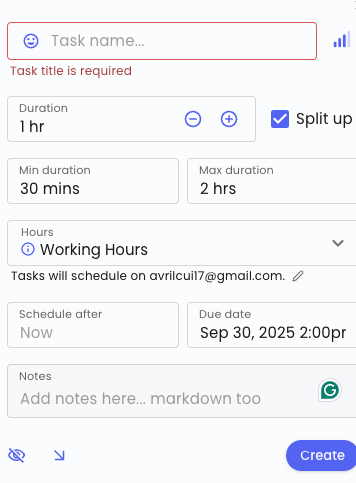

1. select planned calendar, actual schedule, or view both on the same calendar
2. when things goes unexpected, pop up and ask, want to reschedule automatically?
    - has an option to select always reschedule
    - generate a new calendar with reschduled version

3. autogenerate focus time, relax time, debrief time, etc.
4. book meeting with link
5. start and end by select a task on calendar or enter a new task
6. generate priority as category, log by color
    - select color code by priority or task type
7. enter total duration, break into # of blocks, drag to calendar
8. generate priority automatically based on input fields
9. predependence and post dependence, remember to sync
10. if linked task, pass task name as sessionname
11. same session can exist many times
12. add more detailed edit page for ai generated outcomes

