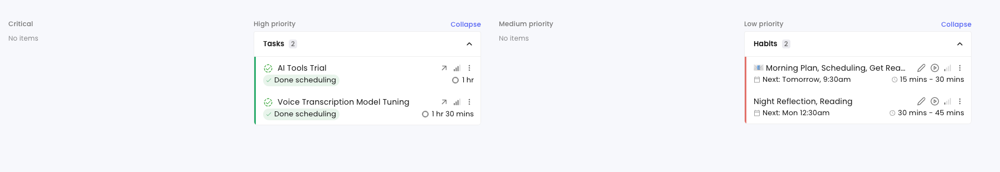

1. select planned calendar, actual schedule, or view both on the same calendar
2. when things goes unexpected, pop up and ask, want to reschedule automatically?
    - has an option to select always reschedule
    - generate a new calendar with reschduled version

3. autogenerate focus time, relax time, debrief time, etc.
4. book meeting with link
5. start and end by select a task on calendar or enter a new task

